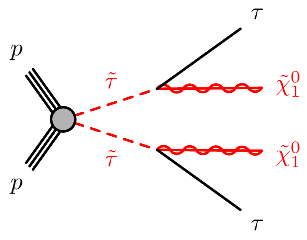
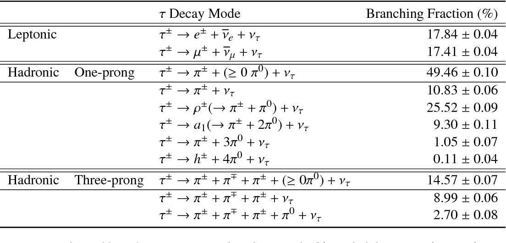
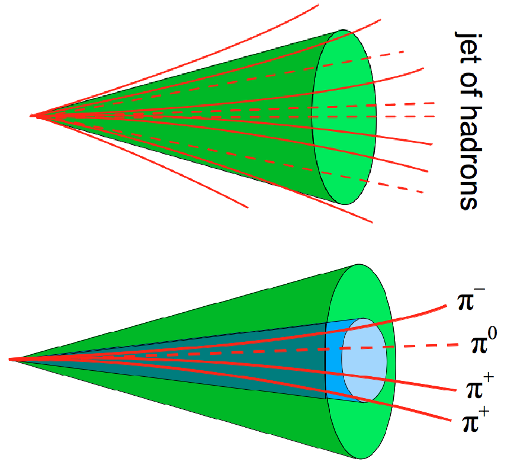
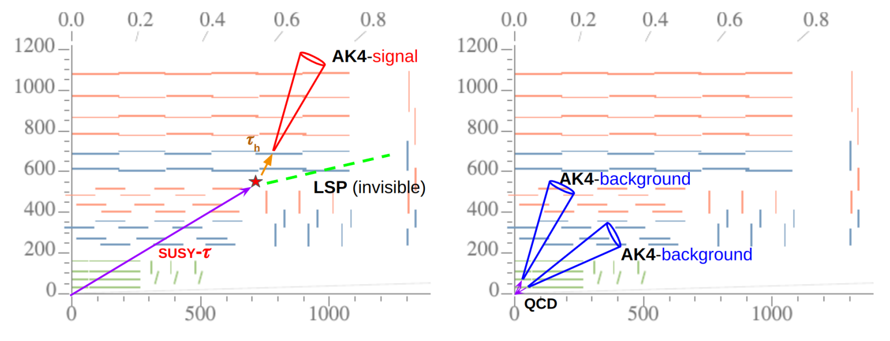

## Getting started in DESY-NAF

Mode info: https://confluence.desy.de/display/IS/NAF+Login%2C+WGS+and+remote+Desktop

### Login

We will use the naf-gpu login node. Here `<username>` is your DESY username.

```bash
ssh -XY <username>@naf-cms-gpu01.desy.de
```

### Create clone repo

```bash
cd /nfs/dust/cms/user/<username>/
git clone https://github.com/shedprog/distautag-summer.git

```

### Create working directory

```bash
cd /nfs/dust/cms/user/<username>/distautag-summer
git submodule init
git submodule update
```

### Initialization of the submodules

```bash
cd /nfs/dust/cms/user/<username>/distautag-summer
git submodule init
git submodule update
```

### Installing conda environment

```bash
cd /nfs/dust/cms/user/<username>/softDESYSUMMER/distautag-summer/DisTauMLTools
source env.sh conda
```

your anaconda environment will be installed to `DisTauMLTools/soft/conda`

to activate your environment next time you connect to naf:
```bash
source env.sh conda
```

## Understanding the input

This project aims at optimization of the identification of the displaced taus that are daughters of long-lived stau (susy-tau) particles:



More information on tau particle reconstruction and identification can be found here: https://arxiv.org/pdf/1809.02816.pdf

First, when we are talking about tau we assume hydronically decaying tau (that forms jet, 
technically these jets are called AK4-jets). Tau decays to the neutral and charged pions and then they are clustered in the jet. Available tau decay modes:



The most significant background that fakes tau-based jets are quarks/gluons/electrons/muons that create same picture in our detector and mis-reconstructed as tau. In this project we will target only discrimination versus quarks/gluons (QCD) jets. 



Additionally, in our case signal jets will be displaced corresponding to the center of coordinates



